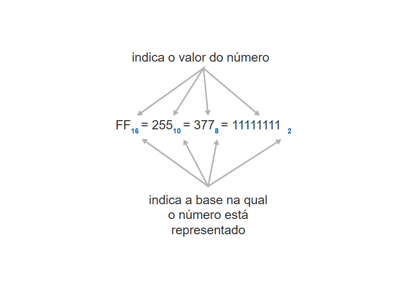
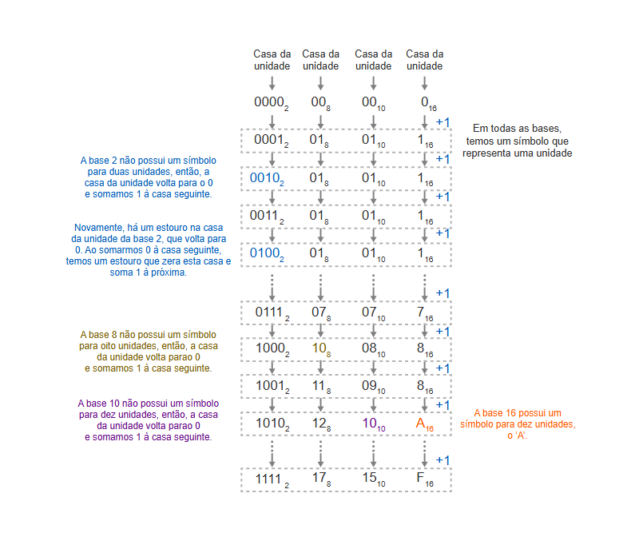
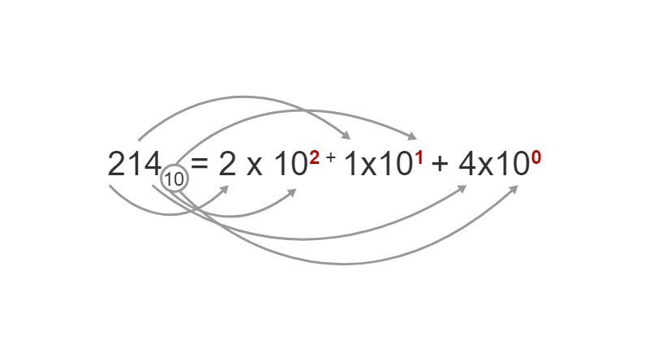
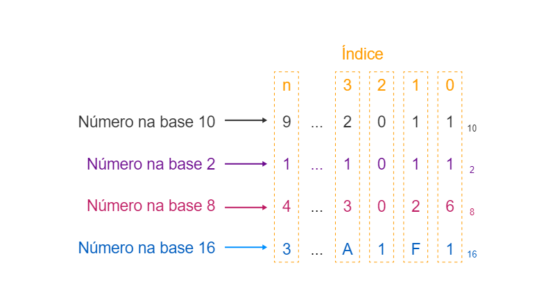
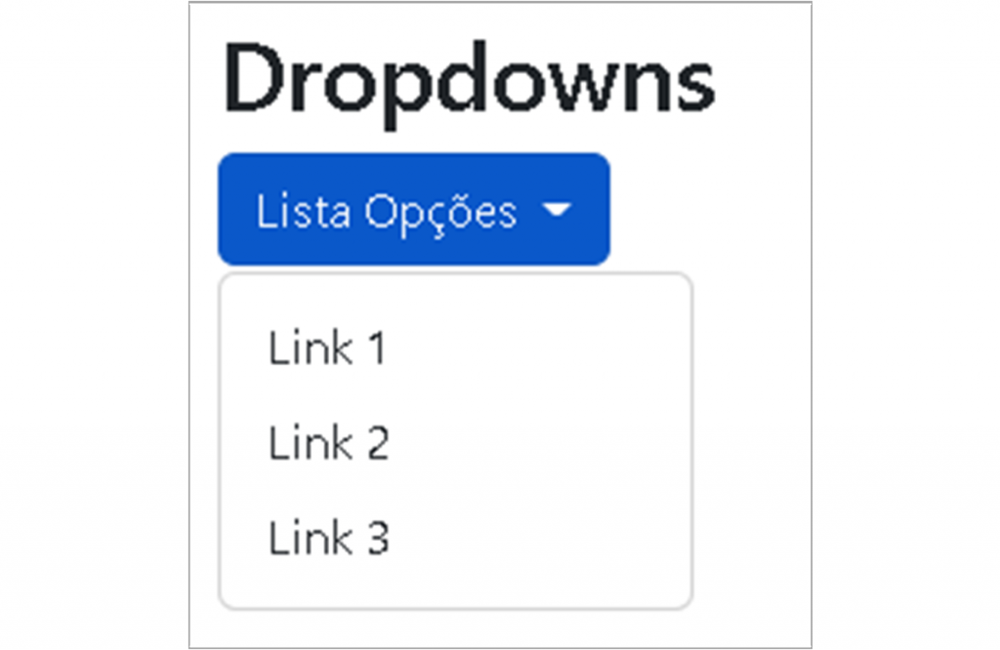
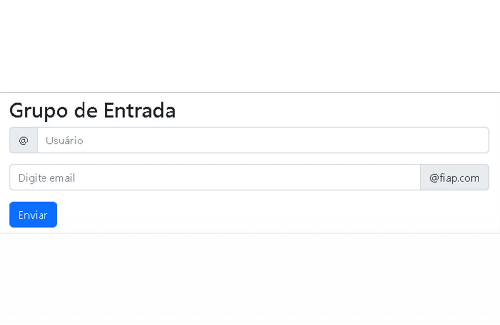
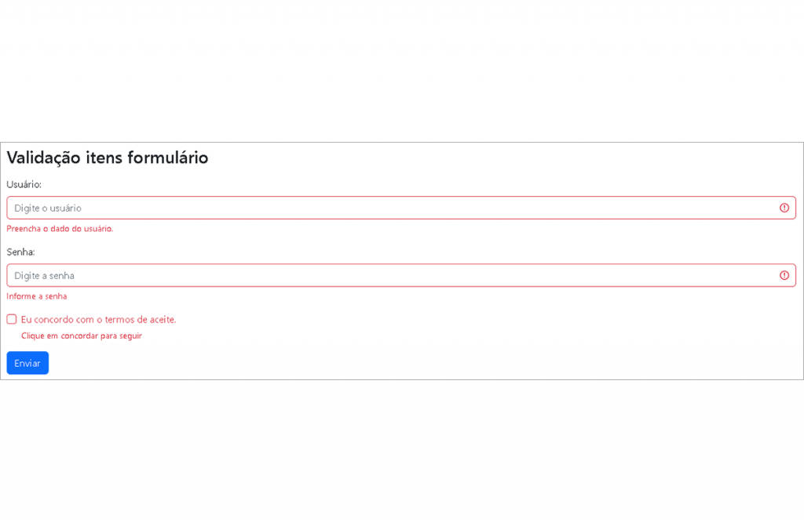
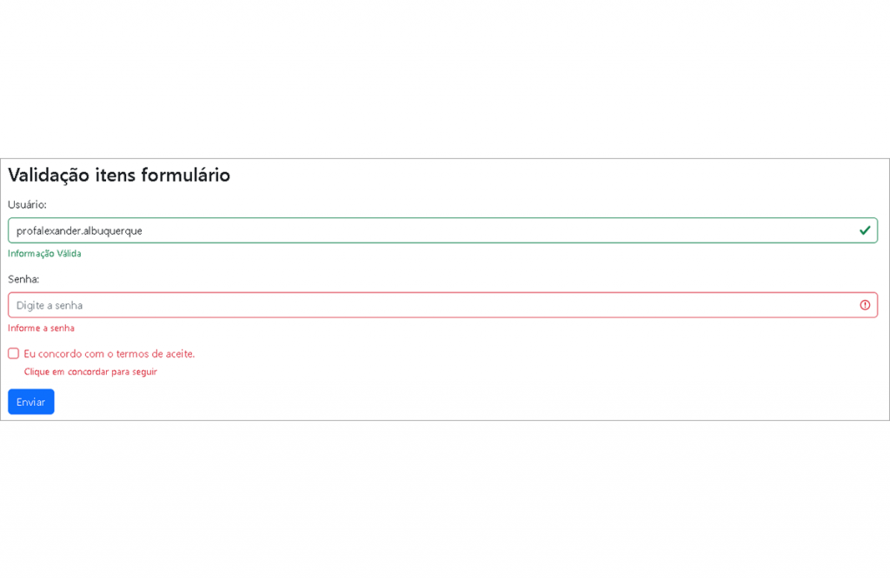
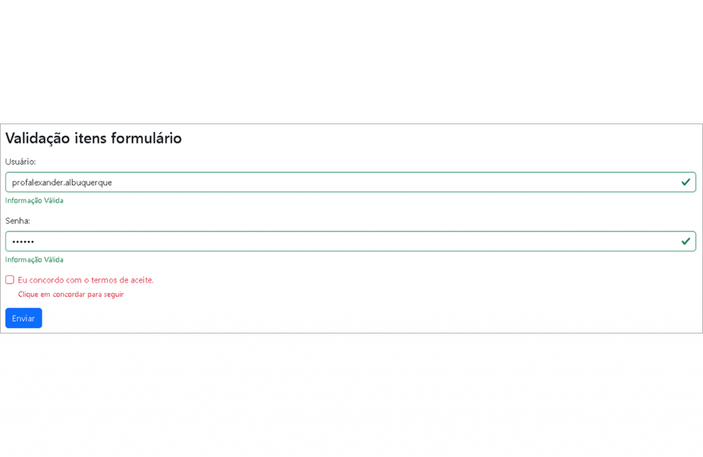
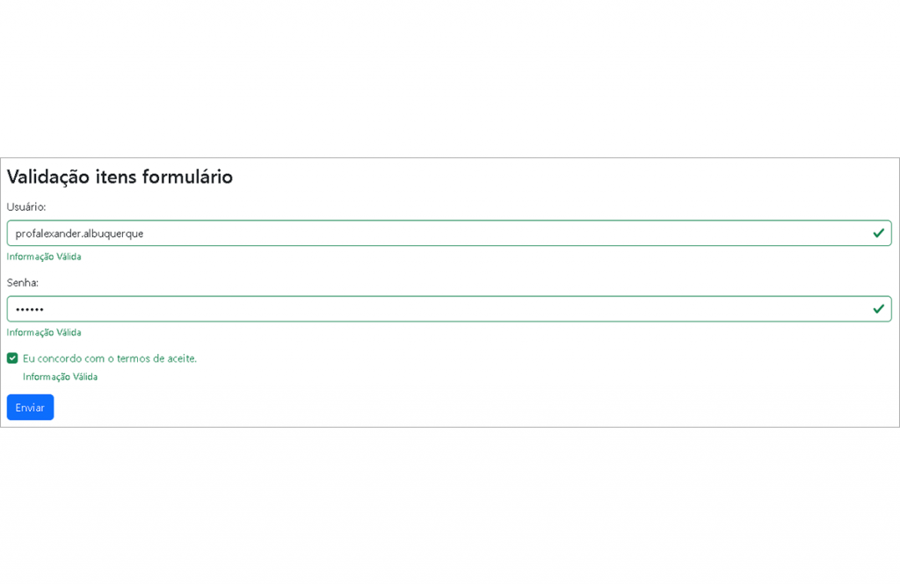

<div name="readme-top">
    <h1 align=center>CAPÍTULO 2</h1>
</div>

>**Capítulo 2 - Um Pouco Mais de Bootstrap**

# INTRODUÇÃO

Framework CSS para contrução do front-end de aplicações web e que utiliza um sistema de grid responsivo. Esse sistema permite desenvolver com grande facilidade páginas que se adaptam aos diferentes tamanhos de tela, como de smartphone, notebook etc.

Exemplo de código básico utilizando o Bootstrap:

```html
<!DOCTYPE html>
<html lang="en">
<head>
  <title>Bootstrap 5 Example</title>
  <meta charset="utf-8">
  <meta name="viewport" content="width=device-width, initial-scale=1">
  <link href="https://cdn.jsdelivr.net/npm/bootstrap@5.1.3/dist/css/bootstrap.min.css" rel="stylesheet">
  <script src="https://cdn.jsdelivr.net/npm/bootstrap@5.1.3/dist/js/bootstrap.bundle.min.js"></script>
</head>
<body>

<div class="container-fluid p-5 bg-primary text-white text-center">
  <h1>My First Bootstrap Page</h1>
  <p>Resize this responsive page to see the effect!</p> 
</div>
  
<div class="container mt-5">
  <div class="row">
    <div class="col-sm-4">
      <h3>Column 1</h3>
      <p>Lorem ipsum dolor sit amet, consectetur adipisicing elit...</p>
      <p>Ut enim ad minim veniam, quis nostrud exercitation ullamco laboris...</p>
    </div>
    <div class="col-sm-4">
      <h3>Column 2</h3>
      <p>Lorem ipsum dolor sit amet, consectetur adipisicing elit...</p>
      <p>Ut enim ad minim veniam, quis nostrud exercitation ullamco laboris...</p>
    </div>
    <div class="col-sm-4">
      <h3>Column 3</h3>        
      <p>Lorem ipsum dolor sit amet, consectetur adipisicing elit...</p>
      <p>Ut enim ad minim veniam, quis nostrud exercitation ullamco laboris...</p>
    </div>
  </div>
</div>
</body>
</html>
```

Para desenvolver alguns exemplos, será utilizado o código que está disponível na **CDN** (*Content Delivery Network*), onde o jsDelivr fornece suporta à CDN para CSS e JavaScript do Bootstrap:

```html
<!DOCTYPE html>
<html lang="en">
<head>
  <title>Bootstrap 5 Example</title>
  <meta charset="utf-8">
  <meta name="viewport" content="width=device-width, initial-scale=1">
  <link href="https://cdn.jsdelivr.net/npm/bootstrap@5.1.3/dist/css/bootstrap.min.css" rel="stylesheet">
  <script src="https://cdn.jsdelivr.net/npm/bootstrap@5.1.3/dist/js/bootstrap.bundle.min.js"></script>
</head>
<body>
```

<p align="right">(<a href="#readme-top">back to top</a>)

# FORMULÁRIOS

Os formulários são um meio muito utilizado de enviar informações, existem várias formas de disponibilizarmos os dados e os diferentes tipos de campos.

> Como Construir um Formulário e Utilizar Seus Componentes [[Formulário básico](Exemplos/FormularioBasico.html)]

## Visão Geral

Os controles de formulário do Bootstrap melhoram os vários elementos existentes.

|                     **Elemento**                      | **Descrição**                                                                                                                                        |
|:-----------------------------------------------------:|:-----------------------------------------------------------------------------------------------------------------------------------------------------|
|                     `<fieldset>`                      | Não possuem bordas, preenchimentos ou margens para que possam ser facilmente usados como *wrappers* para entradas individuais ou grupos de entradas. |
|                      `<legend>`                       | Como *fieldsets*, também foram modificados para serem exibidos como um tipo de cabeçalho.                                                            |
|                       `<label>`                       | São definidos para **display: inline-block** permitir **margin** na aplicação.                                                                       |
| `<input>`<br>`<select>`<br>`<textarea>`<br>`<button>` | São endereçados principalmente por **Normalize**, mas **Reboot** remove seus **margin** e configurou os **line-height: inherit**                     |
|                     `<textarea>`                      | Foram modificados para serem redimensionáveis apenas verticalmente, pois o redimensionamento horizontal geralmente distorce o layout da página.      |
|                `<bottom>`<br>`<input>`                | Se tornaram elementos de botão e acrescentam o **cursor: pointer**                                                                                   |

Certifique-se de usar um atributo apropriado em todas as entradas (por exemplo, **email** para receber endereço de e-mail, ou **number** para informações numéricas) a fim de aproveitar os controles de entrada mais recentes, como verificação de e-mail, seleção de número e muito mais.

Exemplo básico de formulário:

```html
<!DOCTYPE html>
<html lang="en">
  <head>
    <title>Formulário Básico</title>
    <meta charset="utf-8">
    <meta name="viewport" content="width=device-width, initial-scale=1">
    <link href="https://cdn.jsdelivr.net/npm/bootstrap@5.1.3/dist/css/bootstrap.min.css" rel="stylesheet">
    <script src="https://cdn.jsdelivr.net/npm/bootstrap@5.1.3/dist/js/bootstrap.bundle.min.js"></script>
  </head>
<body>
  <form>
    <div class="mb-3">
      <label for="idEmail" class="form-label">Email</label>
      <input type="email" class="form-control" id="idEmail" aria-describedby="emailHelp">
      <div id="emailHelp" class="form-text">Preencha corretamente o campo email</div>
    </div>
    <div class="mb-3">
      <label for="idPassword" class="form-label">Senha</label>
      <input type="password" class="form-control" id="idPassword">
    </div>
    <button type="submit" class="btn btn-primary">Enviar</button>
  </form>    
</body>
</html>
```

<p align="right">(<a href="#readme-top">back to top</a>)

# NOTAÇÃO

Utilitários de espaçamento que se aplicam a todos os *brakpoints* (de **xs** até **xl**), não possuem abreviações. Isso acontece porque essas classes são usadas de **min-wisth: 0** para cima, sem *media queries* limitantes. No entando, os demais utilitários possuem abreviações de *breakpoint*.

As classes são definidas usando o formato **{*propriedade*}{*lados*}-{*tamanho*}** para breakpoint **xs** e **{*propriedade*}{*lados*}-{*breakpoint*}-{*tamanho*}** para **sm**, **md**, **lg**, **xl**.

O campo propriedade pode ser:

- **m** - para usar **margin**
- **p** - para usar **padding**
 
<p align="right">(<a href="#readme-top">back to top</a>)

## Botões

Como utilizar as classes para mudar o visual do componente.

```html
<button type="button" class="btn">Básico</button>
<button type="button" class="btn btn-primary">Primário</button>
<button type="button" class="btn btn-secondary">Secundário</button>
<button type="button" class="btn btn-success">Sucesso</button>
<button type="button" class="btn btn-info">Informativo</button>
<button type="button" class="btn btn-warning">Alerta</button>
<button type="button" class="btn btn-danger">Atenção</button>
<button type="button" class="btn btn-dark">Escurso</button>
<button type="button" class="btn btn-light">Claro</button>
<button type="button" class="btn btn-link">Link</button>
```



<p align="right">(<a href="#readme-top">back to top</a>)

## Formulário Empilhado

Todos os elementos textuais `<input>` e `<textarea>` com classe **.form-control** obtêm um estilo de forma adequado:

```html
<form action="">
  <div class="mb-3 mt-3">
    <label for="email">Email:</label>
    <input type="email" class="form-control" id="email" placeholder="Digite o email" name="email">
  </div>
  <div class="mb-3">
    <label for="pwd">Password:</label>
    <input type="password" class="form-control" id="pwd" placeholder="Digite a senha" name="pswd">
  </div>
  <div class="form-check mb-3">
    <label class="form-check-label">
      <input class="form-check-input" type="checkbox" name="remember"> Armazenar informação
    </label>
  </div>
  <button type="submit" class="btn btn-primary">Enviar</button>
</form>
```



Observe também que adicionamos uma classe **.form-label** para cada elemento de rótulo, a fim de garantir o preenchimento correto.

As caixas de seleção possuem marcações diferentes. Elas são agrupadas por meio de um elemento de contêiner chamado **.form-check**, os tótulos têm uma classe **.form-check-label** e as caixas de seleção têm uma classe **.form-check-label**, enquanto as caixas de seleção e os botões de opção utilizam **.form-check-input**.

<p align="right">(<a href="#readme-top">back to top</a>)

# ÁREA DE TEXTO

Nesse atributo é necessário utilizar a classe **form-control**.

> Utilizando um `<textarea>` [[TextArea.html](Exemplos/AreaDeTexto.html)]

```html
<form action="">
  <div class="mb-3 mt-3">
    <label for="comment">Comentários:</label>
    <textarea class="form-control" rows="5" id="comment" name="text"></textarea>
  </div>
  <button type="submit" class="btn btn-primary">Enviar</button>
</form>
```

<p align="right">(<a href="#readme-top">back to top</a>)

# FORMULÁRIO EM LINHA OU GRADE

Pode contruir um formulário no qual os elementos ficarão dispostos um ao lado do outro; para isso, devemos utilizar as classes **.row** e **.col**.

```html
<form>
  <div class="row">
    <div class="col">
      <input type="text" class="form-control" placeholder="Digite o email" name="email">
    </div>
    <div class="col">
      <input type="password" class="form-control" placeholder="Digite a senha" name="pswd">
    </div>
  </div>
  <div class="row mt-3">
    <div class="col">
      <button type="submit" class="btn btn-primary">Enviar</button>
    </div>
  </div>
</form>
```



<p align="right">(<a href="#readme-top">back to top</a>)

# ENTRADAS DE TEXTO SIMPLES

Muito parecida com o **textarea**, porém não há a possibilidade de habilitar colunas e linhas no objeto. No bootstrap, é possível ter acesso à entrada de texto simples por meio da class **.form-contorl-plaintext**.

```html
<form action="">
  <div class="mb-3 mt-3">
    <label for="comment">Comentários:</label>
    <input type="text" id="comment" class="form-control-plaintext" placeholder="Digite um texto">
    <input type="text" class="form-control mt-3" placeholder="Digite um outro texto">
  </div>
  <button type="submit" class="btn btn-primary">Enviar</button>
</form>
```

<p align="right">(<a href="#readme-top">back to top</a>)

## Selecione o Menu

> Utilizando elementos de seleção [[Usando **\<datalist\>**](./Exemplos/SelecaoMenu.html)]

Seleção de uma opção por meio de uma caixa de seleção é muito utilizada, isso evita que o usuário digite alguma informação errada. Possível criar uma seleção que só permite a escolha de 1 item; ou permitir a escolha de vários itens.

Para estilizar um menu de seleção no Bootstrap 5, adicione a **.form-select** classe ao elemento `<select>`:

```html
<!DOCTYPE html>
<html lang="en">
<head>
  <title>Bootstrap Select</title>
  <meta charset="utf-8">
  <meta name="viewport" content="width=device-width, initial-scale=1">
  <link href="https://cdn.jsdelivr.net/npm/bootstrap@5.2.1/dist/css/bootstrap.min.css" rel="stylesheet">
  <script src="https://cdn.jsdelivr.net/npm/bootstrap@5.2.1/dist/js/bootstrap.bundle.min.js"></script>
</head>
<body>
  <div class="container mt-3">
    <h2>Select Menu</h2>
    <form action="">
      <label for="sel1" class="form-label">Permite selecionar apenas 1 item:</label>
      <select class="form-select" id="sel1" name="sellist1">
        <option>Faculdade 1</option>
        <option>Faculdade 2</option>
        <option>Faculdade 3</option>
        <option>Faculdade 4</option>
      </select><br>
      <label for="sel2" class="form-label">Permite selecionar 1 ou mais:</label>
      <select multiple class="form-select" id="sel2" name="sellist2">
        <option>Faculdade 1</option>
        <option>Faculdade 2</option>
        <option>Faculdade 3</option>
        <option>Faculdade 4</option>
      </select>
      <button type="submit" class="btn btn-primary mt-3">Enviar</button>
    </form>
  </div>
</body>
</html>
```

| Quantidade de Itens |                              Código                               |
|:-------------------:|:-----------------------------------------------------------------:|
|   Somente UM ITEM   |     `<select class="form-select" id="sel1" name="sellist1">`      |
|   UM ITEM OU MAIS   | `<select multiple class="form-select" id="sel2" name="sellist2">` |

<p align="right">(<a href="#readme-top">back to top</a>)

# OPÇÃO DE CHECKBOX

Checkbox permite marcar e desmarcar.

> Utilizando **checkbox** normal e em switch [[Checkbox.html](./Exemplos/Checkbox.html)]

Para utilizar os ***checkbox***, deve utilizar o *wrapper* com **class="form-check"**, para garantir margens adequadas para rótulos e caixas de seleção.

É necessário utilizar a class **.form-check-label** para rotular os elementos, e a classe **.form-check-input** para estilizar corretamente as caixas de seleção dentro do container **.form-check**.

Caso queira utilizar um elemento já selecionado, use o atributo **checked**.

```html
<form action="">
  <div class="form-check">
    <input type="checkbox" class="form-check-input" id="ck1" name="option1" value="something" checked>
    <label class="form-check-label" for="ck1">Opção 1</label>
  </div>
  <div class="form-check">
    <input type="checkbox" class="form-check-input" id="ck2" name="option2" value="something">
    <label class="form-check-label" for="ck2">Opção 2</label>
  </div>
  <div class="form-check">
    <input type="checkbox" class="form-check-input" disabled>
    <label class="form-check-label">Opção 3</label>
  </div>
  <button type="submit" class="btn btn-primary mt-3">Enviar</button>
</form>
```



# OPÇÃO DE DROPDOWN

o *dropdown* é um menu suspenso, esse tipo de opção é muito utilizada por possibilitar ao usuário ter uma opção de escolha dentro de uma lista com valores definidos.

A classe **.dropdown** é utilizada para indicar um menu suspenso; para ter acesso ao objeto, deve-se utilizar a classe **.dropdown-menu** de modo a realmente contruir o menu suspenso.

Para abrir o menu suspenso, use um botão ou um link com uma classe de **.dropdown-toogle** e **data-toggle="dropdown"**.

```html
<div class="dropdown">
  <button type="button" class="btn btn-primary dropdown-toggle" data-bs-toggle="dropdown">
    Lista Opções
  </button>
  <ul class="dropdown-menu">
    <li><a class="dropdown-item" href="#">Link 1</a></li>
    <li><a class="dropdown-item" href="#">Link 2</a></li>
    <li><a class="dropdown-item" href="#">Link 3</a></li>
  </ul>
</div>
```



# OPÇÃO DE GRUPO DE INPUTS

Utilizando a classe **.input-group** é possível acrescentar ícones, textos e botões na frente ou no fim dos campos de entradas.

Para utilizar o texto de ajuda especificado, use a classe **.input-group-text**.

```html
<form action="">
  <div class="input-group mb-3">
    <span class="input-group-text">@</span>
    <input type="text" class="form-control" placeholder="Usuário" name="usrname">
  </div>
  <div class="input-group mb-3">
    <input type="text" class="form-control" placeholder="Digite email" name="email">
    <span class="input-group-text">@fiap.com</span>
  </div>
  <button type="submit" class="btn btn-primary">Enviar</button>
</form>
```



# VALIDAÇÃO DE FORMULÁRIO

Possível utilizar diferentes classes de validação para fornecer feedback aos usuários. para usar, é necessário adicionar a class **.was-valited** ou **needs-validation** à tag `<form>`. tudo vai depender de como vai querer a validação, o feedback de validação pode ser feito antes ou depois de envias os dados do formuçário. Os campos de entrada terão uma borda verde (válida) ou vermelha (inválida) para indicar o que está faltando no formulário.

Também pode adicionar uma mensagem, utilizando a classe **.valid-feedback** ou **.invalid-feedback**, mostrando ao usuário o que precisa ser feito antes de submeter o formulário.

```html
<form action="" class="was-validated">
  <div class="mb-3 mt-3">
    <label for="uname" class="form-label">Usuário:</label>
    <input type="text" class="form-control" id="uname" placeholder="Digite o usuário" name="uname" required>
    <div class="valid-feedback">Informação Válida</div>
    <div class="invalid-feedback">Preencha o dado do usuário.</div>
  </div>
  <div class="mb-3">
    <label for="pwd" class="form-label">Senha:</label>
    <input type="password" class="form-control" id="pwd" placeholder="Digite a senha" name="pswd" required>
    <div class="valid-feedback">Informação Válida</div>
    <div class="invalid-feedback">Informe a senha</div>
  </div>
  <div class="form-check mb-3">
    <input class="form-check-input" type="checkbox" id="chkPermissao"  name="remember" required>
    <label class="form-check-label" for="myCheck">Eu concordo com o termos de aceite.</label>
    <div class="valid-feedback">Informação Válida</div>
    <div class="invalid-feedback">Clique em concordar para seguir</div>
  </div>
  <button type="submit" class="btn btn-primary">Submit</button>
</form>
```

|    |   |
|:---------------------------------:|:----------------------------------:|
|  |  |

# UTILIZANDO TODOS OS ELEMENTOS NO FORMULÁRIO

> Utilizando todos os elementos em um formulário de login [[FormularioCompleto.html](./Exemplos/FormularioCompleto.html)]
